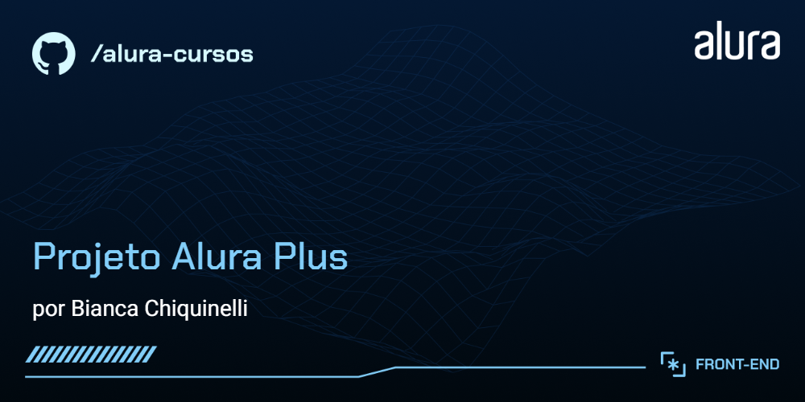

# Alura Plus

Estrutura inicial do projeto criada a partir do curso "A partir do zero: HTML e CSS para projetos web" da Alura

## 🔨 Funcionalidades do Alura Plus

O Alura Plus é um projeto front-end desenvolvido como prática do curso "A partir do zero: HTML e CSS para projetos web" da Alura. A aplicação simula a interface de uma plataforma de streaming, focando apenas na construção visual e na responsividade, sem funcionalidades de back-end ou integração com APIs.

## ✔️ Técnicas e tecnologias utilizadas

As técnicas e tecnologias utilizadas pra isso são:

- Construção de um site utilizando `HTML e CSS,` reforçando conceitos essenciais de front-end.
- Uso do `Figma` para identificar elementos e estilos, simulando uma experiência real de trabalho com design UX/UI.
- Criação de um repositório no `GitHub` para armazenar e compartilhar o código do projeto.
Realização do deploy do site através do GitHub Pages ou Vercel, disponibilizando um link público de acesso.
- Experiência prática ao transformar o layout fornecido pelo designer em uma aplicação visual funcional.
- Inclusão de um novo projeto no portfólio, demonstrando habilidades em desenvolvimento web e publicação de projetos.

## 📁 Acesso ao projeto

Você pode [ acessar o Alura Plus através deste link](https://alura-plus-flame-theta-93.vercel.app/) 

